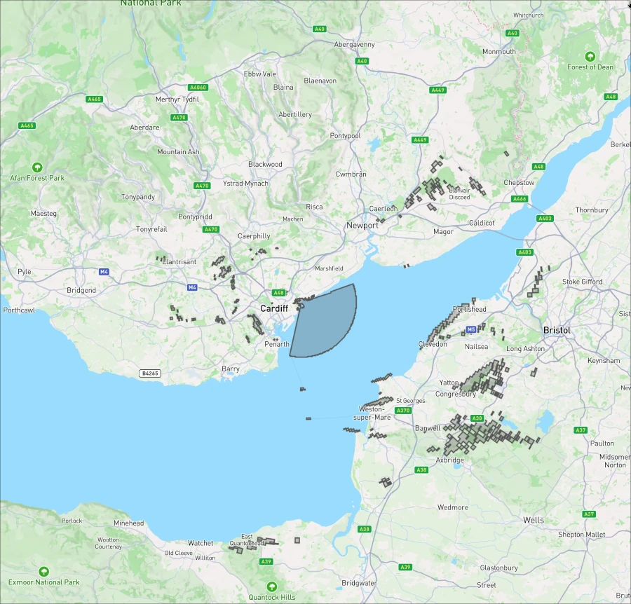
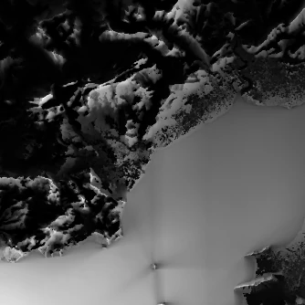

# Total Viewshed Analysis
This project simultaneously calculates _all_ the viewsheds in a given region. It is faster than using a traditional tool like [Arcgis](http://pro.arcgis.com/en/pro-app/tool-reference/3d-analyst/viewshed.htm) to calculate many viewsheds sequentially.

A viewshed is a geographical term to describe the area of the planet that can be seen by an observer. Typically the viewshed from the summit of a mountain will be large and in a valley it will be small.

Here is an example of a single viewshed in Cardiff Bay, Wales, created by this application:


It's not as simple to view the output of total viewshed analysis. Rendering every single viewshed for a given region just appears as meaningless noise. So a more useful format is a heatmap of total viewshed surface (TVS) area. Here is such a heatmap for the same region as above:



The whiter a pixel in a heatmap the more can be seen by an observer at that point. And vice-versa for darker pixels. A TVS heatmap extent is always 1/9th the size of its source data. This is because it can't calculate visibility for all 360 degrees at the edges of the source data.

## Algorithm
This project originally took inspiration from the work of Siham Tabik, Antonio R. Cervilla, Emilio Zapata, Luis F. Romero in their 2014
paper _Efficient Data Structure and Highly Scalable Algorithm for Total-Viewshed Computation_: https://ieeexplore.ieee.org/document/6837455

However it now takes an approach unique in the academic literature. We share the goals of improving memory access found in the previously mentioned authors' 2021 paper, https://arxiv.org/pdf/2003.02200, but we use rotation rather than skewing.

For the line of sight visibility calculations, CacheTVS takes inspiration from the line of sight visibility calculation
which was used as an example in Blelloch's 1993 paper, _Prefix Sums and Their Applications_: https://www.cs.cmu.edu/~guyb/papers/Ble93.pdf

## Kernels
There are 2 kernels; a CPU SIMD-based one and a GPU-based one. The CPU kernel is in fact significantly more performant than the GPU kernel and so is set as the default. The only reason for the GPU kernel is that it is a continuation of an earlier C++ kernel and so acts as a reference implementation to verify the new CPU kernel.

## Use case
The primary use case for this project is to find the longest line of sight on the planet. We present our results at [alltheviews.world](https://alltheviews.world).

## Input file format
Any file format supported by `gdal` should be supported. It must follow this requirements:
* It must be perfectly square.
* The width must be divisible by 48.
* It must be in an AEQD or similar metric projection whose anchor is the centre of the tile.
* All points must be the same metric distance apart.

The best source of elevation data I have found is here: https://www.viewfinderpanoramas.org/Coverage%20map%20viewfinderpanoramas_org3.htm It's mostly in the `.hgt` format, but can easily be converted to `.bt` using `gdal_translate`.

## Usage
Eg: `RUST_LOG=trace cargo run --release -- compute input.bt --scale 100 --process total-surfaces`

A heatmap of total viewshed surface areas will be saved to `./output/heatmap.png`. The path can be changed with `--output-dir path/to/dir`.

### Individual Viewsheds
Typically you won't want to process viewsheds as it incurs a significant time cost from all the extra data that's generated. But processing viewsheds can be useful for verification and benchmarks.

Eg: `RUST_LOG=trace cargo run --release -- compute input.bt --scale 100 --process viewsheds`

Once that's run, you will have access to what's called "ring data", stored by default at `output/ring_data`. This can be used to reconstruct _any_ viewshed from within the TVS. Example:
`RUST_LOG=trace cargo run --release -- viewshed output -- -3.1230,51.4898`


### CLI
```
  Generate _all_ the viewsheds for a given Digital Elevation Model, therefore the total viewsheds.

  Usage: tvs <COMMAND>

  Commands:
    compute       Run main computations
    viewshed      Reconstruct a viewshed
    post-process  Post-processing tasks
    help          Print this message or the help of the given subcommand(s)

  Options:
    -h, --help
            Print help

    -V, --version
            Print version


* Compute
  Run main computations

  Usage: tvs compute [OPTIONS] <Path to the DEM file>

  Arguments:
    <Path to the DEM file>
            The input DEM file. Currently only `.hgt` files are supported

  Options:
        --rings-per-km <Expected rings per km>
            The maximum number of visible rings expected per km of band of sight. This is the number of times land may appear and disappear for an observer looking out into the distance. The value is used to decide how much memory is reserved for collecting ring data. So if it is too low then the program may panic. If it is too high then performance is lost due to unused RAM

            [default: 5]

        --observer-height <Height of observer in meters>
            The height of the observer in meters

            [default: 1.65]

        --backend <The method of running the kernel>
            Where to run the kernel calculations

            Possible values:
            - vulkan:     A SPIRV shader run on the GPU via Vulkan
            - vulkan-cpu: Vulkan shader but run on the CPU
            - cpu:        Optimised cache-efficient CPU kernel
            - cuda:       TBC

            [default: cpu]

        --output-dir <Directory to save output to>
            Directory to save results in

            [default: ./output]

        --scale <DEM scale (meters)>
            Override the calculated DEM points scale from the DEM file. Units in meters

        --process <What to compute>
            What to compute

            Possible values:
            - all:            Calculate everything
            - total-surfaces: Compute the total visible surfaces for each computable DEM point and output as a heatmap
            - viewsheds:      Compute all the ring sectors saving them to disk so that they can be used to later reconstruct viewsheds
            - longest-lines:  Compute the longest line of sight for each DEM point

            [default: all]

        --heatmap <Heatmap normalisation method>
            How to normalise heatmap data

            Possible values:
            - unit-scale:  Just scale between 0 and 1
            - exponential: Scale between 0 and 1 with an exponential factor
            - welford:     Use Z-score normalisation based on Welford's algorithm. This basically means that the data is redistributed such that the mean is 0.5. Useful for overly dark or bright heatmaps. https://en.wikipedia.org/wiki/Algorithms_for_calculating_variance#Welford's_online_algorithm

            [default: exponential]

        --refraction <Air refraction coefficient>
            Air refraction coefficient. Therefore, how much impact refraction has on visibility. Values typically range from 0.1 (less impact) to 0.2 (more impact)

            [default: 0.13]

        --thread-count <Thread count>
            Thread count used for CPU parallelism

            [default: 8]

        --disable-image-render
            Controls line of sight and total viewshed image generation

        --viewsheds-db-path <viewshed storage path>
            Where to store the viewshed data. Requires build with `--features=ring_data`

            [default: ./viewsheds.db]

        --aoi-point <Lon/lat coords of region>
            Lon/lat coordinates for a polygon that represents an Area of Interest within the DEM. Points outside this polygon will be ignored

        --database-per-thread
            Creates a database per thread, managed by an additional worker thread

    -h, --help
            Print help (see a summary with '-h')


* Viewshed
  Reconstruct a viewshed

  Usage: tvs viewshed <Path to existing database> <Viewshed output directory> [COORDINATES]...

  Arguments:
    <Path to existing database>
            Path or directory where viewshed DB was saved

    <Viewshed output directory>
            Directory to save viewshed in

    [COORDINATES]...
            Coordinates to reconstruct viewsheds for

  Options:
    -h, --help
            Print help


* Post-process
  Post-processing tasks

  Usage: tvs post-process [OPTIONS] <Path to existing databases>

  Arguments:
    <Path to existing databases>
            Directory where viewshed DBs were saved

  Options:
        --threads <Number of threads to use>
            Number of threads to use. Defaults to letting Rayon choose the thread count

    -h, --help
            Print help

```

## Building Vulkan shader
* Install `cargo-gpu`: `cargo install --git https://github.com/rust-gpu/cargo-gpu cargo-gpu`
* Compile:
  * `cargo gpu build --watch --shader-crate crates/kernels/vulkan-and-cpu`

Note that the pre-compiled shader already comes with the source code (at `crates/shader/total_viewsheds_kernel.spv`). So you only need to compile the shader if you're developing it.

## License
The license is the same as that used for the original paper's sample code: https://github.com/SihamTabik/Total_Viewshed

## Notes

### Errors caused by AEQD projection
To do all the viewshed calculations we assume the DEM data is projected to an AEQD projection with an anchor in the centre of the tile. For the longest lines of sight on the planet, ~500km, the worst case errors caused by the projection can reach ~0.0685%. This error is only relevant to viewsheds at the edge of the computable area of the tile, therefore those viewsheds around 500km from the centre of the tile. Therefore depending on your usecase you may want to choose different bounds for your tile so that critical regions are nearer the centre and so suffer less errors.

### Further Reading
* https://en.wikipedia.org/wiki/Long_distance_observations
* Norwegian Defense Research has perhaps the best introduction covering the maths of Viewshed analysis: https://www.ffi.no/no/Rapporter/15-01300.pdf
